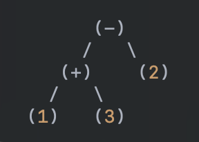

- [Simple PLY + Visitor Example](#simple-ply--visitor-example)
  - [Parsing Arithmetic Expressions](#parsing-arithmetic-expressions)
  - [Writing a Parser using PLY](#writing-a-parser-using-ply)
  - [Lexer](#lexer)
  - [Parser](#parser)
  - [Evaluating the Value of the Expression](#evaluating-the-value-of-the-expression)
    - [How Visitor Works?](#how-visitor-works)
      - [Considerations](#considerations)
  - [Reading Next](#reading-next)
    - [Category Assignment](#category-assignment)


# Simple PLY + Visitor Example

Current directory contains [code](src) of a simple example
of a parser for simple arithmetic expressions
and a visitor for evaluating the value of the
expression.

## Parsing Arithmetic Expressions

Assume that we want to parse simple expressions
that only include integer numbers and `+` or `-`
operators.
So, the goal is to parse a string like `1 + 3 - 2`
and evaluate it to value of 2.

## Writing a Parser using PLY

You need at least two modules to have a complete
parser:

- [`lexer.py`](src/lexer.py)
- [`parser.py`](src/parser.py)

`lexer.py` defines the tokens and `parser.py` defines the grammar rules.

## Lexer

In this file we define the tokens and how lexer should recognize them.
First, we need to define a variable named `tokens` that contains a list
of token names.

```python
# lexer.py

tokens = ['NUM', 'OP']
```

Then for each token we should either define a regular expression
or function with the name 't_token'.

```python
t_OP = r'[+\*]'


def t_NUM(t):
    r'(\d+)'
    t.value = int(t.value)
    return t
```

Since we defined tokens `NUM` and `OP` we need to define
regex for them using `t_OP` and `t_NUM` variables.

When using functions, the first line should be a regex that matches the token,
then we can do additional processing we need, e.g. converting the value to int.

A special token "ignore" specifies the characters to be ignored such as whitespace.

```python
t_ignore = ' \t'
```

## Parser

Here we define the rules of our grammar as a function.
Going back to our expression parser example, to parse
the expression `1 + 3 - 2` we can use the following grammar:

```bnf
expr ::= NUM | expr OP expr
```

> As a convention, terminal symbols are written in UPPERCASE
> and rules in lowercase.

For each rule named `rule` we should define a function
named `p_rule`.
Thus, to write the parser for `expr` rule we need
a function named `p_expr`.
The goal of these functions are to construct [`ASTNode`](src/node.py)
and return them as a result of parsing.
The first statement of the function should be a string that specifies our BNF grammar rule.
> This string is called docstring in standard Python and is used as a documentation
> for the function

```python
def p_expr(p):
    '''expr : NUM
            | expr OP expr'''
```

> This specific format matters, meaning you should put each alternative (separated by `|`)
> in a separate line.

In the grammar rule specification, the left-hand side of the `:`
should be the name our rule.
In the right-hand side, each word should be a rule name or a token.
For instance, here we are using the `NUM` and `OP` tokens
and `expr` rule itself, thus defining a recursive rule.

Now, let's understand how these functions are called.
Consider `1 + 3 - 2` and its extracted tokens list as
`[NUM, OP, NUM, OP, NUM]`.
Assuming that parser reads input from left to right,
it first encounters a `NUM` token.
A single `NUM` matches the first alternation of the
`expr` rule.
Now, after detecting this match, PLY calls our `p_expr`
function giving it the `p` argument.
The `p` is a list of objects, one for each word of the matching rule.
For instance, the matched alternative is `expresssion : NUMBER`,
thus `p = [_, 1]`.

> The first element of the list is an special object that
> is explained below.

Remember that the goal of the function is to return
an ASTNode object.
So, let's do that in case that we match a `NUM`:

```python
def p_expr(p):
    '''expr : NUMBER 
            | expr OP expr'''
    if len(p) == 2:
        p[0] = NumNode(p[1])
```

Thus, by checking the number of the elements in `p`,
we identify that the matched rule is `expr : NUM`
and then we construct a `NumNode` object.

> The special mechanism of PLY is that `p[0]` should refer to
> the parsed object that is the result of applying current
> rule.
> Thus, instead of returning the resulting object, we need
> to assign to `p[0]`.

We still need to complete the function to handle the
case where we match the second alternation.
Let's continue parsing our token list: `[NUM, OP, NUM, OP, NUM]`.
Assume that parser already parsed the first three tokens,
thus we have `[expr, OP, expr, OP, NUM]`.
First three tokens matches the second alternative of
expression rule.
This time parser calls our function with
a list `p = [_, NumNode(1), '*', NumNode(2)]`
as argument.
So, you can see that elements corresponding to a rule
name in our grammar are already parsed and passed in
as a `ASTNode` object.
Now that PLY already done the parsing of the sub-expressions
we can simply complete the function as follows:

```python
def p_expression(p):
    '''expr : NUMBER 
                  | expr OP expr'''
    if len(p) == 2:
        p[0] = NumLiteralNode(p[1])
    if len(p) == 4:
        p[0] = BinExprNode(p[1], p[2], p[3])
```

Now our parser is complete.
So we can simply call the parser on a string to get a `ASTNode`
object:

```python
parser = get_parser()
expr = '1 + 3 - 2'
node = parser.process_ast(expr)
```

In this code, the `node` contains an object of
type `BinExprNode`.

## Evaluating the Value of the Expression

### How Visitor Works?

Let's explain visitor pattern implementation using
the `1 + 3 - 2` expression.

Assume that we have an abstract `ASTNode` class:

```python
class ASTNode(ABC):
    pass
```

And, we have two concrete sub-classes for binary expressions
and numbers:

```python
class NumNode(ASTNode):
    value: int


class BinExprNode(ASTNode):
    left: ASTNode
    op: BinOperator
    right: ASTNode
```

You can see that each left and right expressions can
be an `ASTNode`.
Thus, in each side of an operator, we can either have
number literal or a sub expression.

Let's create the `ASTNode` object for our expression:

```python
one = NumNode(1)
two = NumNode(2)
three = NumLiteralNode(3)
sub_expr = BinExprNode(one, '+', three)
expr = BinExprNode(sub_expr, '-', two)
```

Thus, we constructed the exact same structure as the following
figure:



Next, we create a visitor class.
Consider the visitor as an object that traverse the tree
and do some processing based on the type of node it visits.

```python
class Visitor(ABC):
    @abstractmethod
    def visit_num(self, node: NumNode):
        pass

    @abstractmethod
    def visit_bin_expr(self, node: BinExprNode):
        pass
```

Then, we make our node classes to accept a visitor:

```python
class NumNode(ASTNode):
    def accept(self, visitor: Visitor):
        return visitor.visit_num(self)


class BinExprNode(ASTNode):
    def accept(self, visitor: Visitor):
        return visitor.visit_bin_expr(self)
```

To use a visitor on our expression we might
have the following code:

```python
expr = BinExprNode('1 + 2 * 3')
visitor = Visitor()
result = expr.accept(visitor)
```

> This is the text-book way of implementing visitor pattern.
> Why? It's related to the [double-dispatch concept](https://refactoring.guru/design-patterns/visitor-double-dispatch)
> which might make this document unnecessarily complicated!
> So, I do not discuss this here :) Read the mentioned link if you wish to dig deeper!

Now, let's implement something useful with a visitor.
Let's write a visitor that evaluates the numeric value
of the given expression.

```python
class Evaluator(Visitor):
    def visit_num_literal(self, node: NumLiteralNode):
        return node.value

    def visit_bin_expr(self, node: BinExprNode):
        left_val = node.left.accept(self)
        right_val = node.right.accept(self)
        if node.op == '+':
            return left_val + right_val
        if node.op == '*':
            return left_val * right_val
```

Using `Evaluator` we can calculate the value of our expresssion
as follows:

```python
expr = BinExprNode('1 + 3 - 2')
visitor = Evaluator()
result = expr.accept(visitor)
assert result == 2
```

Visitor pattern allows us to easily write a new visitor
and process an AST by traversing its structure without
the need to change the nodes themselves.
In the evaluation example above, we implemented the
whole logic of evaluation inside the `Evaluator` visitor
instead of embedding this processing inside the nodes
(e.g. adding a `evaluate` function to each node).

#### Considerations

When using visitor pattern note that:

- You need to add the specific visit method to the visitor
  and all the subclasses whenever you add a new node class.
- You need to implement the accept method inside the new node class

## Reading Next

### [Category Assignment](Category.md)

This link contains category assignment procedure. 

